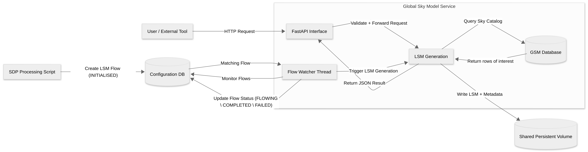

.. _request_design:

Requesting a Local Sky Model
----------------------------

The main purpose of the GSM is to provide a service for requesting
LSM data for processing pipelines to use. Alternatively, the service
also provides an API (see :ref:`lsm_browser`) to obtain the data. The following flow chart
describes the two paths by which one can request an LSM.

.. _sdp_request:

SDP Processing
^^^^^^^^^^^^^^

In the SDP, processing scripts request the deployment of various processing
pipelines, including, e.g. the realtime calibration pipeline, the instrumental
calibration pipeline or the iterative calibration pipeline. All of these
pipelines require an LSM to be available for their calibration
processes to run with high accuracy.

The process to request an LSM follows the `SDP architecture <https://developer.skao.int/projects/ska-sdp-integration/en/latest/index.html>`_.
Processing scripts specify the request parameters via data flow entities (see `ADR-81 <https://confluence.skatelescope.org/display/SWSI/ADR-81+Centralise+SDP+data+product%2C+queue+and+Tango+configuration+as+data+flows>`_),
which are stored in the SDP Configuration database (Config DB).

The GSM Service continuously monitors the Config DB for new LSM requests, and
when it finds one, it extracts the query parameters, then queries the PostgreSQL
database using Q3C (Quad-tree Cube)-based queries. The returned data are then stored in a
CSV file (one per LSM request) in a location that is specified by the data flow entity
and is accessible to both the GSM service and the processing pipelines.

The user guide provides examples of how one can set up their processing scripts
for this process and what the GSM requires in its query parameters: :ref:`request_lsm_processing`.

LSM file contents
^^^^^^^^^^^^^^^^^

The CSV file format used to save the LSM data is described at

.. toctree::
  :maxdepth: 1

  lsm-file-structure

Using the QC3 extension
^^^^^^^^^^^^^^^^^^^^^^^

Q3C (Quad-tree Cube) is a PostgreSQL extension for fast spatial indexing on the sphere.
It maps spherical coordinates (RA/DEC) to an integer pixel index using a quad-tree projection
of the sky. RA/Dec pairs are mapped to a quad-tree pixel index on the sphere (using “q3c_ang2ipix”).
Q3C automatically determines which q3c pixels intersect the search circle, and uses the index to restrict the
candidate set before computing exact distances between rows in the table and the centre of the search.
This prunes huge parts of the table without checking every row, thus speeding up the search time.

Database Query Details
^^^^^^^^^^^^^^^^^^^^^^

The LSM query uses the following approach:

1. Spatial Query: Uses PostgreSQL's q3c extension to efficiently find components
   within a circular region defined by RA, Dec, and FOV radius (all in degrees).

2. Data Retrieval: For each matched source, the system retrieves:

   - Component position (RA, Dec) and identifier
   - Stokes parameters (I, Q, U, V polarization)
   - Source shape parameters (major/minor axes, position angle)
   - Spectral index information

3. Data Model Mapping: Database records are mapped to the GlobalSkyModel data
   structure defined in `ska_sdp_datamodels.global_sky_model <https://gitlab.com/ska-telescope/sdp/ska-sdp-datamodels/-/blob/main/src/ska_sdp_datamodels/global_sky_model/global_sky_model.py>`_:

   - ``GlobalSkyModel``: Top-level container with metadata and a dictionary of components
   - ``SkyComponent``: Contains component ID, position (RA, Dec), Stokes parameters,
     morphology (major_ax, minor_ax, pos_ang), and spectral index as a list of coefficients

4. Result Format: Returns a ``GlobalSkyModel`` object containing a dictionary
   of ``SkyComponent`` objects (keyed by component ID) with all relevant astronomical
   measurements for components within the requested field of view.

5. Output Format: The LSM is written as a CSV file with named columns matching the
   ``SkyComponent`` dataclass fields. Metadata is written as a YAML file in the parent
   directory as specified in the Flow configuration.
