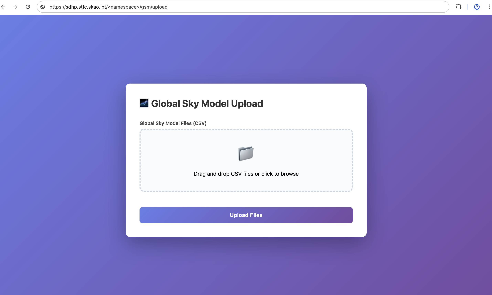
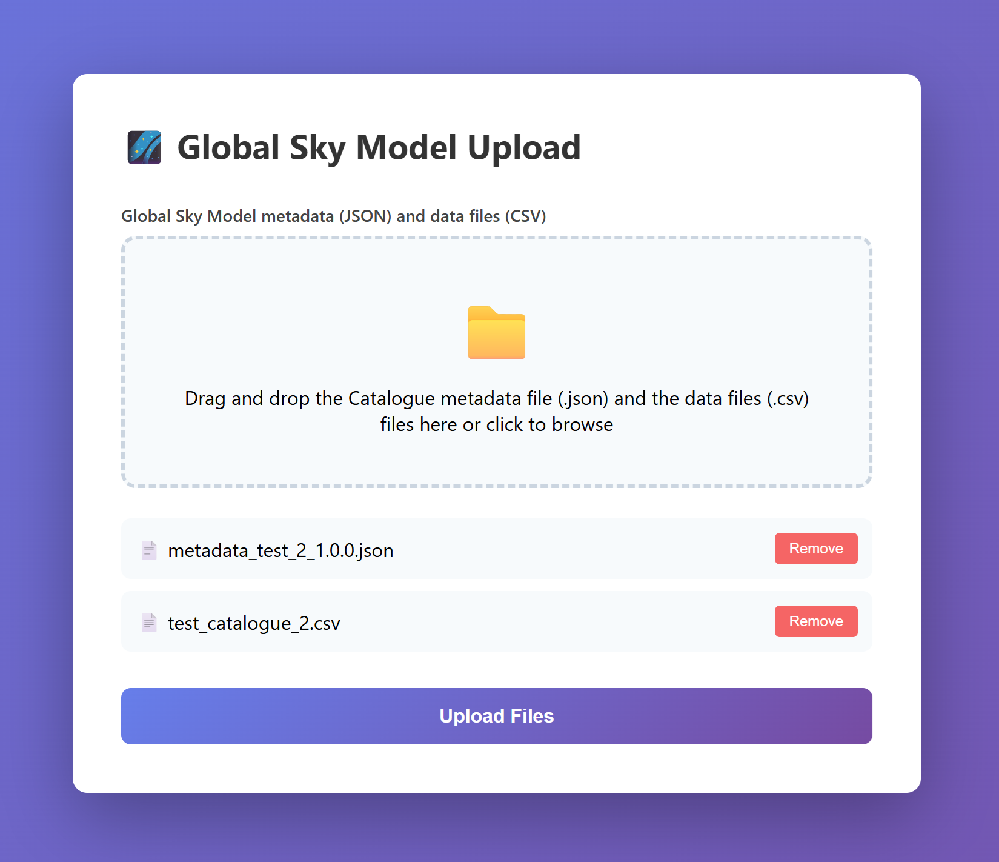
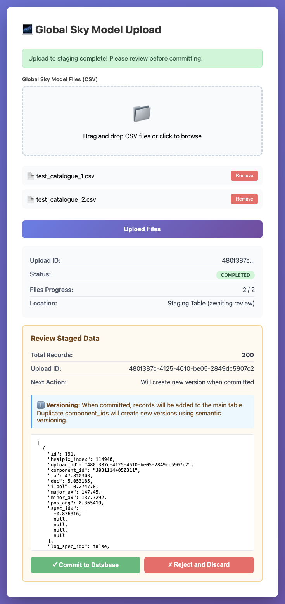
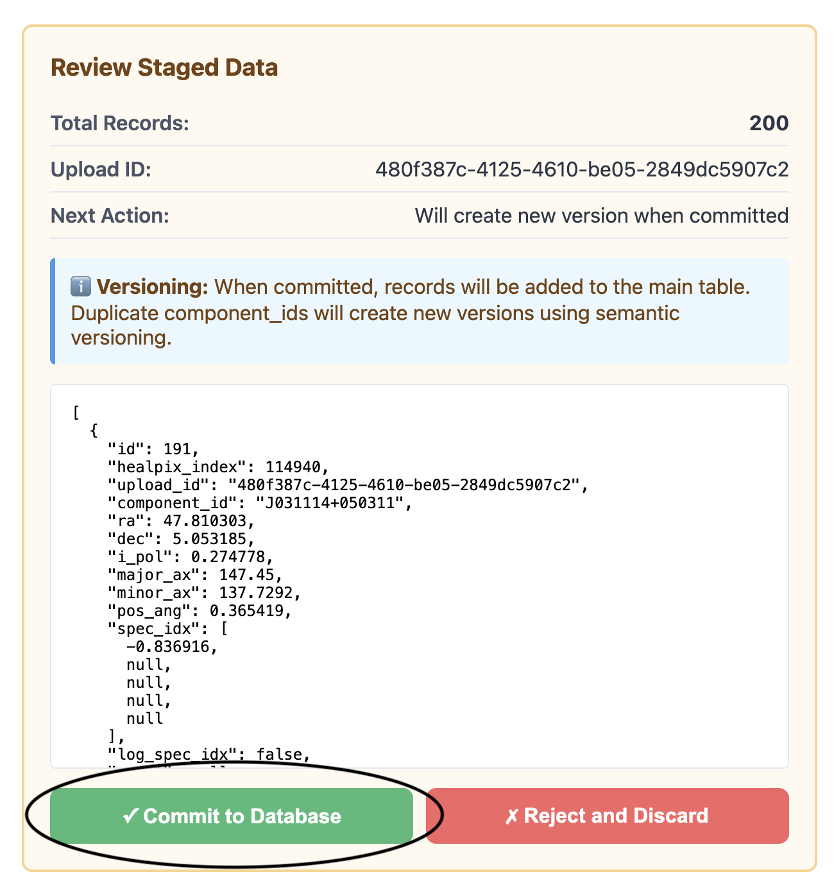
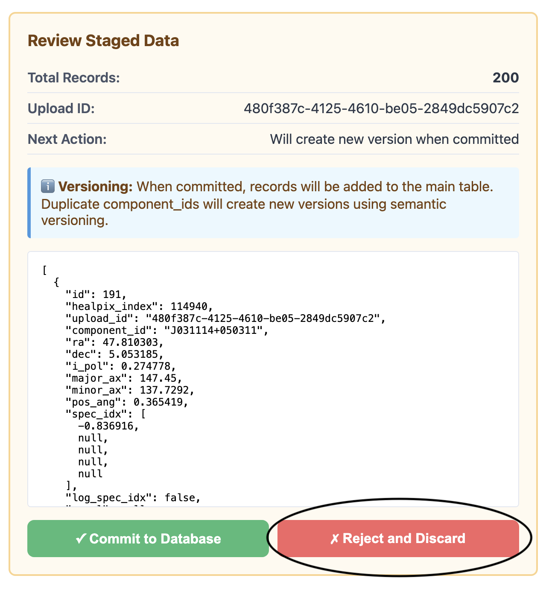

.. _batch_upload:

Uploading GSM data
------------------

The GSM provides both a browser interface and API endpoints
for uploading multiple sky survey catalogue files in a single atomic
batch operation into the GSM database.

Browser upload interface
^^^^^^^^^^^^^^^^^^^^^^^^

A browser interface is available at the ``/upload`` endpoint (e.g., ``<GSM_API_URL>/upload``).

1. Navigate to ``<GSM_API_URL>/upload`` in your web browser (replace ``<GSM_API_URL>`` with your deployment URL)

   Initial upload interface screen

2. Drag and drop CSV files, containing data for a single catalogue version, onto the upload zone (or click to browse)

   Interface showing files selected for upload

3. Click "Upload Files" to begin the upload
4. Monitor the upload progress - status updates automatically
5. Confirm the upload completed successfully and review the count of staged records

   Interface showing files have been uploaded and staged

6. Click "Commit to Database" to approve or "Reject and Discard" to cancel

   Confirm or reject uploaded data

The browser interface also provides:

    - Real-time status monitoring
    - Displays version information of the committed data
    - Displays errors if upload fails

The expected CSV format is described at :ref:`upload_csv_format` and examples are shown at :ref:`example_upload_csv`.

.. _upload_api:

API Endpoints
^^^^^^^^^^^^^

=============================================== ==================================================== ==============
Endpoint                                        Parameters                                           Description
=============================================== ==================================================== ==============
``POST /upload-sky-survey-batch``               - ``files``:  One or more CSV files containing       :ref:`upload_ingest_ep`
                                                  standardized sky survey data
                                                  - data type: ``list[File]``
                                                  - required: True
----------------------------------------------- ---------------------------------------------------- --------------
``GET /upload-sky-survey-status/{upload_id}``   - ``upload_id``: Unique identifier returned when     :ref:`upload_status_ep`
                                                  the upload was initiated
                                                  - data type: ``string (UUID)``
                                                  - required: True
----------------------------------------------- ---------------------------------------------------- --------------
``GET /review-upload/{upload_id}``              - ``upload_id``: Unique identifier returned when     :ref:`review_upload_ep`
                                                  the upload was initiated
                                                  - data type: ``string (UUID)``
                                                  - required: True
----------------------------------------------- ---------------------------------------------------- --------------
``POST /commit-upload/{upload_id}``             - ``upload_id``: Unique identifier of the staged     :ref:`commit_upload_ep`
                                                  upload to commit
                                                  - data type: ``string (UUID)``
                                                  - required: True
----------------------------------------------- ---------------------------------------------------- --------------
``DELETE /reject-upload/{upload_id}``           - ``upload_id``: Unique identifier of the staged     :ref:`reject_upload_ep`
                                                  upload to reject
                                                  - data type: ``string (UUID)``
                                                  - required: True
----------------------------------------------- ---------------------------------------------------- --------------
=============================================== ==================================================== ==============

.. _upload_ingest_ep:

Upload and ingest CSV files
...........................

**Endpoint**: ``POST /upload-sky-survey-batch``

Upload and ingest one or more sky survey CSV files to the staging table.
All files in the batch are combined into a single sky model.
If any file fails validation or ingestion, the entire batch is rolled back.

.. list-table::
    :widths: 20, 50, 20, 10
    :header-rows: 1

    * - Parameter
      - Description
      - Data Type
      - Required
    * - ``files``
      - One or more CSV files containing standardized sky survey data
      - list[File]
      - Yes

**Response**:

.. code-block:: json

    {
        "upload_id": "550e8400-e29b-41d4-a716-446655440000",
        "status": "uploading"
    }

The endpoint returns immediately with status "uploading". Ingestion to staging table proceeds
asynchronously in the background. Use the status endpoint to monitor completion, then review and commit.

**Example Usage**:

.. code-block:: bash

    # Upload one or more CSV files with standardized column names
        curl -X POST "<GSM_API_URL>/upload-sky-survey-batch" \
            -F "files=@test_catalogue_1.csv;type=text/csv" \\
            -F "files=@test_catalogue_2.csv;type=text/csv"

**Python Example**:

.. code-block:: python

    import requests
    import time

    url = "<GSM_API_URL>/upload-sky-survey-batch"

    # Upload multiple CSV files with standardized column names
    files = [
        ("files", ("test_catalogue_1.csv", open("test_catalogue_1.csv", "rb"), "text/csv")),
        ("files", ("test_catalogue_2.csv", open("test_catalogue_2.csv", "rb"), "text/csv")),
    ]
    response = requests.post(url, files=files)

    result = response.json()
    print(f"Upload ID: {result['upload_id']}")
    print(f"Status: {result['status']}")  # Will be "uploading"

    # Poll for completion
    status_url = f"{url.replace('/upload-sky-survey-batch', '')}/upload-sky-survey-status/{result['upload_id']}"
    while True:
        status_response = requests.get(status_url)
        status_data = status_response.json()
        if status_data['state'] in ['completed', 'failed']:
            break
        time.sleep(2)

    print(f"Final status: {status_data['state']}")

.. _upload_status_ep:

Get upload status
.................

**Endpoint**: ``GET /upload-sky-survey-status/{upload_id}``

Retrieve the current status of a sky survey batch upload.

.. list-table::
    :widths: 20, 50, 20, 10
    :header-rows: 1

    * - Parameter
      - Description
      - Data Type
      - Required
    * - ``upload_id``
      - Unique identifier returned when the upload was initiated
      - string (UUID)
      - Yes

**Response**:

.. code-block:: json

    {
        "upload_id": "550e8400-e29b-41d4-a716-446655440000",
        "state": "completed",
        "total_files": 3,
        "uploaded_files": 3,
        "remaining_files": 0,
        "errors": []
    }

**Upload States**:

- ``pending``: Upload created but not started
- ``uploading``: Files are being uploaded and validated
- ``completed``: All files uploaded and ingested successfully
- ``failed``: Upload failed (see ``errors`` field for details)

**Example Usage**:

.. code-block:: bash

    curl "<GSM_API_URL>/upload-sky-survey-status/550e8400-e29b-41d4-a716-446655440000"

**Python Example**:

.. code-block:: python

    import requests
    import time

    upload_id = "550e8400-e29b-41d4-a716-446655440000"
    url = f"<GSM_API_URL>/upload-sky-survey-status/{upload_id}"

    while True:
        response = requests.get(url)
        status = response.json()

        print(f"State: {status['state']}")
        print(f"Progress: {status['uploaded_files']}/{status['total_files']}")

        if status['state'] in ['completed', 'failed']:
            break

        time.sleep(2)

    if status['state'] == 'failed':
        print(f"Errors: {status['errors']}")

.. _review_upload_ep:

Review staged upload
....................

**Endpoint**: ``GET /review-upload/{upload_id}``

Review the status of the upload before committing to the main database.
Returns total record count and the last 10 staged records to confirm all data loaded successfully.

.. list-table::
    :widths: 20, 50, 20, 10
    :header-rows: 1

    * - Parameter
      - Description
      - Data Type
      - Required
    * - ``upload_id``
      - Unique identifier returned when the upload was initiated
      - string (UUID)
      - Yes

**Response**:

.. code-block:: json

    {
        "upload_id": "550e8400-e29b-41d4-a716-446655440000",
        "total_records": 200,
        "sample": [
            {
                "component_id": "J025837+035057",
                "ra": 0.7793,
                "dec": 0.0672,
                "i_pol": 0.8354,
                "version": null
            }
        ]
    }

**Example Usage**:

.. code-block:: bash

    curl "<GSM_API_URL>/review-upload/550e8400-e29b-41d4-a716-446655440000"

**Python Example**:

.. code-block:: python

    import requests

    upload_id = "550e8400-e29b-41d4-a716-446655440000"
    url = f"<GSM_API_URL>/review-upload/{upload_id}"

    response = requests.get(url)
    review = response.json()

    print(f"Total records: {review['total_records']}")
    print(f"Sample data: {review['sample'][:3]}")  # First 3 records

.. _commit_upload_ep:

Commit Staged Upload
....................

**Endpoint**: ``POST /commit-upload/{upload_id}``

Commit staged data to the main database with automatic dataset versioning. All components in the upload
receive the same version number (the next minor version of the catalogue).

.. list-table::
    :widths: 20, 50, 20, 10
    :header-rows: 1

    * - Parameter
      - Description
      - Data Type
      - Required
    * - ``upload_id``
      - Unique identifier of the staged upload to commit
      - string (UUID)
      - Yes

**Response**:

.. code-block:: json

    {
        "message": "Upload committed successfully",
        "records_committed": 200,
        "upload_id": "550e8400-e29b-41d4-a716-446655440000"
    }

**Example Usage**:

.. code-block:: bash

    curl -X POST "<GSM_API_URL>/commit-upload/550e8400-e29b-41d4-a716-446655440000"

**Python Example**:

.. code-block:: python

    import requests

    upload_id = "550e8400-e29b-41d4-a716-446655440000"
    url = f"<GSM_API_URL>/commit-upload/{upload_id}"

    response = requests.post(url)
    result = response.json()

    print(f"Committed {result['records_committed']} records")
    print(f"Message: {result['message']}")

.. _reject_upload_ep:

Reject Staged Upload
....................

**Endpoint**: ``DELETE /reject-upload/{upload_id}``

Reject and discard staged data. All records associated with this upload_id are permanently deleted from the staging table.

.. list-table::
    :widths: 20, 50, 20, 10
    :header-rows: 1

    * - Parameter
      - Description
      - Data Type
      - Required
    * - ``upload_id``
      - Unique identifier of the staged upload to reject
      - string (UUID)
      - Yes

**Response**:

.. code-block:: json

    {
        "message": "Upload rejected successfully",
        "records_deleted": 200,
        "upload_id": "550e8400-e29b-41d4-a716-446655440000"
    }

**Example Usage**:

.. code-block:: bash

    curl -X DELETE "<GSM_API_URL>/reject-upload/550e8400-e29b-41d4-a716-446655440000"

**Python Example**:

.. code-block:: python

    import requests

    upload_id = "550e8400-e29b-41d4-a716-446655440000"
    url = f"<GSM_API_URL>/reject-upload/{upload_id}"

    response = requests.delete(url)
    result = response.json()

    print(f"Rejected and deleted {result['records_deleted']} records")
    print(f"Message: {result['message']}")

.. _example_upload_csv:

CSV Format Examples
^^^^^^^^^^^^^^^^^^^

**Standardized Format**:

The ``test_catalogue_1.csv`` and ``test_catalogue_2.csv`` files in the test data directory demonstrate
the required standardized format:

.. code-block:: text

    component_id,ra,dec,i_pol,major_ax,minor_ax,pos_ang,spec_idx,log_spec_idx
    J025837+035057,44.656883,3.849425,0.835419,142.417,132.7302,3.451346,-0.419238,False
    J030420+022029,46.084633,2.341634,0.29086,137.107,134.2583,-0.666618,-1.074094,False

These test catalogues contain 100 components each and are used throughout the test suite as reference examples.

**Minimal Format**:

At minimum, you need the four required columns:

.. code-block:: text

    component_id,ra,dec,i_pol
    J000001-350001,0.004,-35.0,0.25
    J000002-350002,0.008,-35.1,0.23
